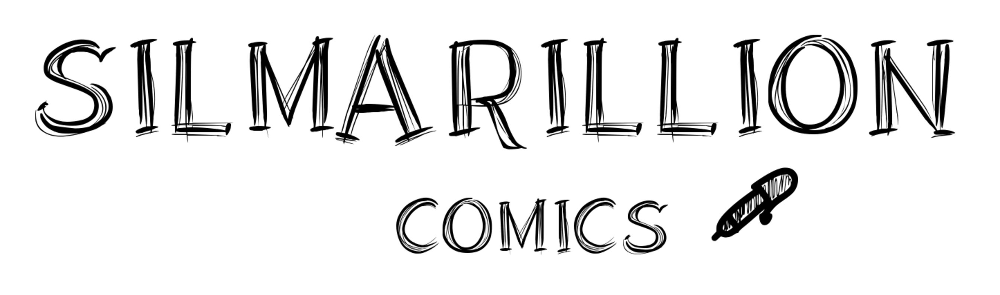

<div id="top"></div>
<!--
*** Thanks for checking out the Best-README-Template. If you have a suggestion
*** that would make this better, please fork the repo and create a pull request
*** or simply open an issue with the tag "enhancement".
*** Don't forget to give the project a star!
*** Thanks again! Now go create something AMAZING! :D
-->

<!-- PROJECT SHIELDS -->
<!--
*** I'm using markdown "reference style" links for readability.
*** Reference links are enclosed in brackets [ ] instead of parentheses ( ).
*** See the bottom of this document for the declaration of the reference variables
*** for contributors-url, forks-url, etc. This is an optional, concise syntax you may use.
*** https://www.markdownguide.org/basic-syntax/#reference-style-links
-->
[![Contributors][contributors-shield]][contributors-url]
[![Forks][forks-shield]][forks-url]
[![Stargazers][stars-shield]][stars-url]
<!--[![MIT License][license-shield]][license-url]-->

<!-- PROJECT LOGO -->
<br />
<div align="center">
  <a href="https://github.com/tassiLuca/silmarillion">
    
  </a>

<h3 align="center">Silmarillion</h3>
  <p align="center">
    Project for 'Tecnologie Web' course @ UniBO
    <br />
    <a href="https://github.com/tassiLuca/silmarillion">View Demo</a>
    ·
    <a href="https://github.com/tassiLuca/silmarillion/issues">Report Bug</a>
    ·
    <a href="https://github.com/tassiLuca/silmarillion/issues">Request Feature</a>
  </p>
</div>

<!-- TABLE OF CONTENTS -->
<details>
  <summary>Table of Contents</summary>
  <ol>
    <li>
      <a href="#about-the-project">About The Project</a>
      <ul>
        <li><a href="#built-with">Built With</a></li>
      </ul>
    </li>
    <li>
      <a href="#getting-started">Getting Started</a>
      <ul>
        <li><a href="#prerequisites">Prerequisites</a></li>
        <li><a href="#installation">Installation</a></li>
      </ul>
    </li>
    <li><a href="#usage">Usage</a></li>
    <li><a href="#roadmap">Roadmap</a></li>
    <li><a href="#contributing">Contributing</a></li>
    <li><a href="#license">License</a></li>
    <li><a href="#contact">Contact</a></li>
  </ol>
</details>

<!-- ABOUT THE PROJECT -->
## About The Project

[![Product Name Screen Shot][product-screenshot]](https://example.com)

Silmarillion is an online comics store.

<p align="right">(<a href="#top">back to top</a>)</p>

### Built With

* [JQuery](https://jquery.com)
* [php](https://www.php.net)

<p align="right">(<a href="#top">back to top</a>)</p>

<!-- GETTING STARTED -->
## Getting Started

### Prerequisites

* PHP 7.3 or above
* [Composer](https://github.com/composer/composer): 
  ```sh
  php -r "copy('https://getcomposer.org/installer', 'composer-setup.php');"
  php -r "if (hash_file('sha384', 'composer-setup.php') === '906a84df04cea2aa72f40b5f787e49f22d4c2f19492ac310e8cba5b96ac8b64115ac402c8cd292b8a03482574915d1a8') { echo 'Installer verified'; } else { echo 'Installer corrupt'; unlink('composer-setup.php'); } echo PHP_EOL;"
  php composer-setup.php
  php -r "unlink('composer-setup.php');"
  sudo mv composer.phar /usr/local/bin/composer
  ```
  For more details, please refer to the instructions at [Composer website](https://getcomposer.org/download/).
* [Respect/Validation](https://github.com/Respect/Validation):
  ```sh
  composer require respect/validation
  ```

### Installation

1. Clone the repo
   ```sh
   git clone https://github.com/tassiLuca/silmarillion.git
   ```
2. Ensures ...

<p align="right">(<a href="#top">back to top</a>)</p>

<!-- USAGE EXAMPLES -->
## Usage

Use this space to show useful examples of how a project can be used. Additional screenshots, code examples and demos work well in this space. You may also link to more resources.

_For more examples, please refer to the [Documentation](https://example.com)_

<p align="right">(<a href="#top">back to top</a>)</p>

<!-- ROADMAP -->
## Roadmap

- [ ] Feature 1
- [ ] Feature 2
- [ ] Feature 3
    - [ ] Nested Feature

See the [open issues](https://github.com/github_username/repo_name/issues) for a full list of proposed features (and known issues).

<p align="right">(<a href="#top">back to top</a>)</p>

<!-- CONTRIBUTING -->
## Contributing

Contributions are what make the open source community such an amazing place to learn, inspire, and create. Any contributions you make are **greatly appreciated**.

If you have a suggestion that would make this better, please fork the repo and create a pull request. You can also simply open an issue with the tag "enhancement".
Don't forget to give the project a star! Thanks again!

1. Fork the Project
2. Create your Feature Branch (`git checkout -b feature/AmazingFeature`)
3. Commit your Changes (`git commit -m 'Add some AmazingFeature'`)
4. Push to the Branch (`git push origin feature/AmazingFeature`)
5. Open a Pull Request

<p align="right">(<a href="#top">back to top</a>)</p>


<!-- LICENSE -->
<!--
## License

Distributed under the MIT License. See `LICENSE.txt` for more information.

<p align="right">(<a href="#top">back to top</a>)</p>

-->

<!-- CONTACT -->
## Contact

Luca Tassinari - [Linkedin]() - luca.tassinari.2000@gmail.com 

Matteo Violani - matteo.violani@gmail.com

Luana Mennuti - @gmail.com

Project Link: [https://github.com/tassiLuca/silmarillion](https://github.com/tassiLuca/silmarillion)

<p align="right">(<a href="#top">back to top</a>)</p>

<!-- MARKDOWN LINKS & IMAGES -->
<!-- https://www.markdownguide.org/basic-syntax/#reference-style-links -->
[contributors-shield]: https://img.shields.io/github/contributors/tassiLuca/silmarillion?style=flat-square
[contributors-url]: https://github.com/tassiLuca/silmarillion/graphs/contributors
[forks-shield]: https://img.shields.io/github/forks/tassiLuca/silmarillion?style=flat-square
[forks-url]: https://github.com/tassiLuca/silmarillion/network/members
[stars-shield]: https://img.shields.io/github/stars/tassiLuca/silmarillion?style=flat-square
[stars-url]: https://github.com/tassiLuca/silmarillion/stargazers
[license-shield]: https://img.shields.io/github/license/tassiLuca/repo_name.svg?style=for-the-badge
[license-url]: https://github.com/tassiLuca/silmarillion/blob/master/LICENSE.txt
[linkedin-shield]: https://img.shields.io/badge/-LinkedIn-black.svg?style=for-the-badge&logo=linkedin&colorB=555
[linkedin-url]: https://linkedin.com/in/linkedin_username
[product-screenshot]: images/screenshot.png